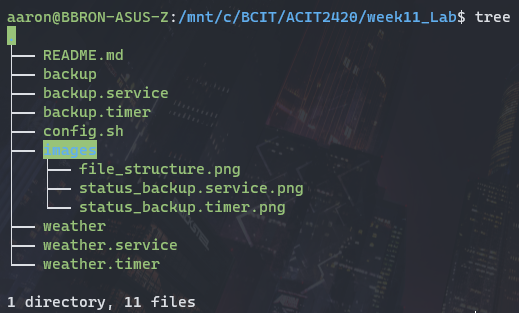
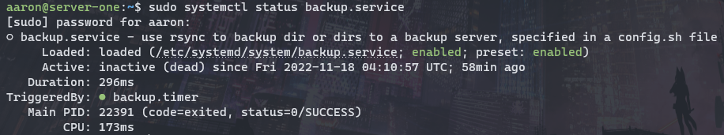
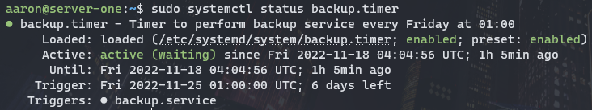

# ACIT 2420 Week 11 Lab

## Repository

### Team Members

  - *Jack Tam A00930311*
  - *Aaron Zhang A01316218*

### File Structure

## Backup Service

Performs a backup to server of specified directory every Friday at 01:00.

### config.sh

  1. Put this file in /opt/backup/
  2. Specify *dir* to backup and the *ip* to send the backup to in config.sh

### backup

  1. Make a directory in /opt named backup: `sudo mkdir /opt/backup`
  2. Put this script in /opt/backup/

### backup.service

  1. Put this file in /etc/systemd/system/
  2. Enable the service: `systemctl enable backup.service`
  3. Verify service is active: `systemctl status backup.service`
  Output should resemble the following:
  

### backup.timer

  1. Put this file in /etc/systemd/system/
  2. Enable the timer: `systemctl enable backup.timer`
  3. Verify timer is active: `systemcl status backup.service`
  Output should resemble the following:

## Weather Service

**weather** - put this script in /opt/getweather/

**weather.service** - put this file in /etc/systemd/system/

**weather.service** - put this file in /etc/systemd/system/
